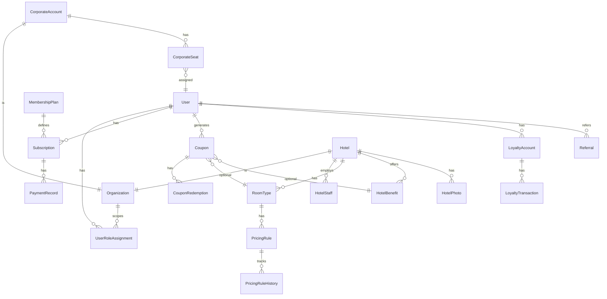

# BusyBeds — Database Design

**Version:** 1.0  
**Status:** Planning  
**Database:** PostgreSQL via Prisma

---

## 1. ERD (Conceptual)



---

## 2. Core Enums

```prisma
enum PlatformRole {
  MEMBER
  BUSYBEDS_ADMIN
  SUPER_ADMIN
}

enum OrgType {
  HOTEL
  CORPORATE
}

enum HotelRole {
  RECEPTION
  MANAGER
  OWNER
}

enum CorporateRole {
  ADMIN
}

enum HotelStatus {
  DRAFT
  PENDING_APPROVAL
  APPROVED
  SUSPENDED
  REJECTED
}

enum PricingContext {
  DEFAULT
  HIGH_SEASON
  LOW_SEASON
  WEEKEND
  HOLIDAY
}

enum PricingRuleStatus {
  DRAFT
  PENDING_APPROVAL
  APPROVED
  REJECTED
  ARCHIVED
}

enum RateType {
  RACK
  STO
}

enum SubscriptionStatus {
  ACTIVE
  PAST_DUE
  CANCELLED
  EXPIRED
  TRIALING
}

enum CouponStatus {
  ACTIVE
  USED
  EXPIRED
  REVOKED
}

enum BenefitType {
  FREE_BREAKFAST
  LATE_CHECKOUT
  SPA_DISCOUNT
  RESTAURANT_DISCOUNT
  AIRPORT_TRANSFER
  ROOM_UPGRADE
  PACKAGE
  OTHER
}

enum NotificationChannel {
  EMAIL
  SMS
  WHATSAPP
  PUSH
}

enum PaymentProvider {
  STRIPE
  FLUTTERWAVE
  PESAPAL
}
```

---

## 3. Prisma Schema (Draft)

```prisma
// prisma/schema.prisma — planning draft; refined during Phase 2 implementation

model User {
  id                String    @id @default(cuid())
  email             String    @unique
  emailVerified     DateTime?
  passwordHash      String?
  firstName         String?
  lastName          String?
  phone             String?
  avatarUrl         String?
  platformRole      PlatformRole @default(MEMBER)
  createdAt         DateTime  @default(now())
  updatedAt         DateTime  @updatedAt
  deletedAt         DateTime?

  roleAssignments   UserRoleAssignment[]
  subscriptions     Subscription[]
  coupons           Coupon[]
  loyaltyAccount    LoyaltyAccount?
  referralsMade     Referral[] @relation("Referrer")
  referredBy        Referral?  @relation("Referee")
  auditLogs         AuditLog[]
  corporateSeats    CorporateSeat[]
}

model Organization {
  id        String   @id @default(cuid())
  type      OrgType
  name      String
  createdAt DateTime @default(now())
  updatedAt DateTime @updatedAt

  hotel            Hotel?
  corporateAccount CorporateAccount?
  roleAssignments  UserRoleAssignment[]
}

model UserRoleAssignment {
  id             String      @id @default(cuid())
  userId         String
  organizationId String?
  hotelRole      HotelRole?
  corporateRole  CorporateRole?
  createdAt      DateTime    @default(now())

  user           User         @relation(fields: [userId], references: [id])
  organization   Organization? @relation(fields: [organizationId], references: [id])

  @@unique([userId, organizationId, hotelRole])
  @@index([userId])
  @@index([organizationId])
}

model Hotel {
  id              String      @id @default(cuid())
  organizationId  String      @unique
  name            String
  slug            String      @unique
  description     String?
  country         String
  city            String
  address         String?
  latitude        Decimal?
  longitude       Decimal?
  starRating      Int?
  category        String?     // resort, lodge, boutique, etc.
  status          HotelStatus @default(DRAFT)
  currency        String      @default("USD")
  policies        Json?
  amenities       String[]
  approvedAt      DateTime?
  approvedById    String?
  createdAt       DateTime    @default(now())
  updatedAt       DateTime    @updatedAt

  organization    Organization @relation(fields: [organizationId], references: [id])
  photos          HotelPhoto[]
  roomTypes       RoomType[]
  benefits        HotelBenefit[]
  coupons         Coupon[]
}

model HotelPhoto {
  id        String   @id @default(cuid())
  hotelId   String
  url       String
  altText   String?
  sortOrder Int      @default(0)
  isPrimary Boolean  @default(false)
  createdAt DateTime @default(now())

  hotel     Hotel    @relation(fields: [hotelId], references: [id])
  @@index([hotelId])
}

model RoomType {
  id          String   @id @default(cuid())
  hotelId     String
  name        String
  description String?
  maxOccupancy Int?
  bedType     String?
  sizeSqm     Decimal?
  amenities   String[]
  isActive    Boolean  @default(true)
  createdAt   DateTime @default(now())
  updatedAt   DateTime @updatedAt

  hotel         Hotel          @relation(fields: [hotelId], references: [id])
  pricingRules  PricingRule[]
  coupons       Coupon[]
  @@index([hotelId])
}

model PricingRule {
  id            String            @id @default(cuid())
  roomTypeId    String
  rateType      RateType          // RACK or STO — paired rules share context+dates
  context       PricingContext    @default(DEFAULT)
  amount        Decimal           @db.Decimal(12, 2)
  currency      String
  validFrom     DateTime
  validTo       DateTime
  // Weekend: apply when dayOfWeek in [5,6] or explicit flag
  appliesFriday Boolean           @default(false)
  appliesSaturday Boolean         @default(false)
  appliesSunday Boolean           @default(false)
  holidayDate   DateTime?         // for HOLIDAY context — specific date
  status        PricingRuleStatus @default(DRAFT)
  rejectionReason String?
  submittedAt   DateTime?
  approvedAt    DateTime?
  approvedById  String?
  createdById   String?
  createdAt     DateTime          @default(now())
  updatedAt     DateTime          @updatedAt

  roomType      RoomType          @relation(fields: [roomTypeId], references: [id])
  history       PricingRuleHistory[]
  @@index([roomTypeId, status, validFrom, validTo])
}

model PricingRuleHistory {
  id            String   @id @default(cuid())
  pricingRuleId String
  snapshot      Json     // full rule state at change time
  changedById   String?
  changeReason  String?
  createdAt     DateTime @default(now())

  pricingRule   PricingRule @relation(fields: [pricingRuleId], references: [id])
}

model HotelBenefit {
  id          String      @id @default(cuid())
  hotelId     String
  type        BenefitType
  title       String
  description String?
  valueLabel  String?     // e.g. "20% off spa"
  minTier     String?     // membership tier gate
  isActive    Boolean     @default(true)
  createdAt   DateTime    @default(now())
  updatedAt   DateTime    @updatedAt

  hotel       Hotel       @relation(fields: [hotelId], references: [id])
  coupons     Coupon[]
  @@index([hotelId])
}

model MembershipPlan {
  id            String   @id @default(cuid())
  slug          String   @unique  // bronze, silver, gold, platinum, corporate
  name          String
  description   String?
  priceAmount   Decimal  @db.Decimal(12, 2)
  priceCurrency String
  interval      String   // month, year
  features      Json
  isActive      Boolean  @default(true)
  sortOrder     Int      @default(0)
  createdAt     DateTime @default(now())
  updatedAt     DateTime @updatedAt

  subscriptions Subscription[]
}

model Subscription {
  id                   String             @id @default(cuid())
  userId               String
  planId               String
  status               SubscriptionStatus
  provider             PaymentProvider
  providerSubscriptionId String?
  currentPeriodStart   DateTime
  currentPeriodEnd     DateTime
  cancelAtPeriodEnd    Boolean            @default(false)
  createdAt            DateTime           @default(now())
  updatedAt            DateTime           @updatedAt

  user                 User               @relation(fields: [userId], references: [id])
  plan                 MembershipPlan     @relation(fields: [planId], references: [id])
  payments             PaymentRecord[]
  @@index([userId, status])
}

model PaymentRecord {
  id              String          @id @default(cuid())
  subscriptionId  String
  provider        PaymentProvider
  providerPaymentId String?
  amount          Decimal         @db.Decimal(12, 2)
  currency        String
  status          String          // succeeded, failed, refunded
  metadata        Json?
  createdAt       DateTime        @default(now())

  subscription    Subscription    @relation(fields: [subscriptionId], references: [id])
}

model Coupon {
  id              String       @id @default(cuid())
  code            String       @unique
  userId          String
  hotelId         String
  roomTypeId      String?
  benefitId       String?
  rackAmount      Decimal?     @db.Decimal(12, 2)
  stoAmount       Decimal?     @db.Decimal(12, 2)
  currency        String?
  status          CouponStatus @default(ACTIVE)
  expiresAt       DateTime
  usedAt          DateTime?
  qrTokenHash     String?      // hashed signed token reference
  createdAt       DateTime     @default(now())

  user            User         @relation(fields: [userId], references: [id])
  hotel           Hotel        @relation(fields: [hotelId], references: [id])
  roomType        RoomType?    @relation(fields: [roomTypeId], references: [id])
  benefit         HotelBenefit? @relation(fields: [benefitId], references: [id])
  redemption      CouponRedemption?
  @@index([userId, status])
  @@index([hotelId, status])
}

model CouponRedemption {
  id              String   @id @default(cuid())
  couponId        String   @unique
  redeemedById    String   // staff user
  hotelId         String
  redeemedAt      DateTime @default(now())
  notes           String?
  metadata        Json?

  coupon          Coupon   @relation(fields: [couponId], references: [id])
}

model LoyaltyAccount {
  id        String   @id @default(cuid())
  userId    String   @unique
  balance   Int      @default(0)
  createdAt DateTime @default(now())
  updatedAt DateTime @updatedAt

  user         User                @relation(fields: [userId], references: [id])
  transactions LoyaltyTransaction[]
}

model LoyaltyTransaction {
  id        String   @id @default(cuid())
  accountId String
  amount    Int      // positive earn, negative spend
  reason    String
  referenceId String?
  createdAt DateTime @default(now())

  account   LoyaltyAccount @relation(fields: [accountId], references: [id])
  @@index([accountId])
}

model Referral {
  id          String   @id @default(cuid())
  referrerId  String
  refereeId   String   @unique
  status      String   // pending, qualified, rewarded
  createdAt   DateTime @default(now())

  referrer    User     @relation("Referrer", fields: [referrerId], references: [id])
  referee     User     @relation("Referee", fields: [refereeId], references: [id])
}

model CorporateAccount {
  id             String   @id @default(cuid())
  organizationId String   @unique
  companyName    String
  billingEmail   String
  seatLimit      Int
  createdAt      DateTime @default(now())
  updatedAt      DateTime @updatedAt

  organization   Organization @relation(fields: [organizationId], references: [id])
  seats          CorporateSeat[]
}

model CorporateSeat {
  id                String   @id @default(cuid())
  corporateAccountId String
  userId            String?
  email             String?  // invite pending
  assignedAt        DateTime?
  createdAt         DateTime @default(now())

  corporateAccount  CorporateAccount @relation(fields: [corporateAccountId], references: [id])
  user              User?            @relation(fields: [userId], references: [id])
  @@index([corporateAccountId])
}

model NotificationLog {
  id        String              @id @default(cuid())
  userId    String?
  channel   NotificationChannel
  event     String
  status    String
  payload   Json?
  createdAt DateTime            @default(now())
  @@index([userId])
}

model AuditLog {
  id         String   @id @default(cuid())
  actorId    String?
  action     String
  resource   String
  resourceId String?
  ipAddress  String?
  metadata   Json?
  createdAt  DateTime @default(now())

  actor      User?    @relation(fields: [actorId], references: [id])
  @@index([actorId, createdAt])
  @@index([resource, resourceId])
}
```

---

## 4. Key Relationships & Constraints

| Relationship | Rule |
|--------------|------|
| User → Subscription | One active subscription per user (enforced in app layer + partial unique index) |
| Hotel → RoomType | Cascade soft-delete; room types referenced by coupons cannot delete |
| PricingRule pairs | Rack + STO for same context/date range should be submitted together (UI workflow) |
| Coupon → User | Must have active subscription at generation time |
| Coupon redemption | Atomic update: status `ACTIVE` → `USED` with redemption row |

---

## 5. Indexing Strategy

| Table | Index | Purpose |
|-------|-------|---------|
| Hotel | `(status, country, city)` | Search filters |
| Hotel | `slug` | Public URLs |
| PricingRule | `(roomTypeId, status, validFrom, validTo)` | Rate resolution |
| Coupon | `(code)` | Fast lookup at verify |
| Subscription | `(userId, status)` | Membership gate |
| AuditLog | `(createdAt)` | Admin audit queries |

Full-text search on `Hotel.name`, `Hotel.city` via PostgreSQL `tsvector` (phase 2) or external search (Algolia) if scale demands.

---

## 6. Rate Resolution Query Pattern

For date `D` and `roomTypeId`:

```sql
-- Conceptual: fetch approved rules, order by context priority
SELECT * FROM pricing_rules
WHERE room_type_id = $1
  AND status = 'APPROVED'
  AND valid_from <= $2 AND valid_to >= $2
ORDER BY
  CASE context
    WHEN 'HOLIDAY' THEN 1
    WHEN 'WEEKEND' THEN 2
    WHEN 'HIGH_SEASON' THEN 3
    WHEN 'LOW_SEASON' THEN 4
    ELSE 5
  END;
```

Application merges highest-priority rack rule with highest-priority sto rule for the same date context.

---

## 7. Data Retention & Privacy

- Soft delete users (`deletedAt`); anonymize PII on account deletion request
- Coupon/redemption data retained 7 years for dispute resolution (configurable)
- Audit logs retained 2 years minimum
- Payment data: provider IDs only, no PAN

---

## 8. Seed Data (Development)

- Membership plans: Bronze, Silver, Gold, Platinum, Corporate
- Super admin user (env-gated)
- Sample hotel with 3 room types and seasonal rates
- Permission seeds for all roles

---

## 9. Migration Strategy

1. Initial migration: users, auth tables (Auth.js adapter tables)
2. Hotels + rooms + rates
3. Memberships + payments
4. Coupons + loyalty
5. Corporate + notifications + audit

Each phase ships with backward-compatible migrations; no destructive migrations in production without dual-write period.
