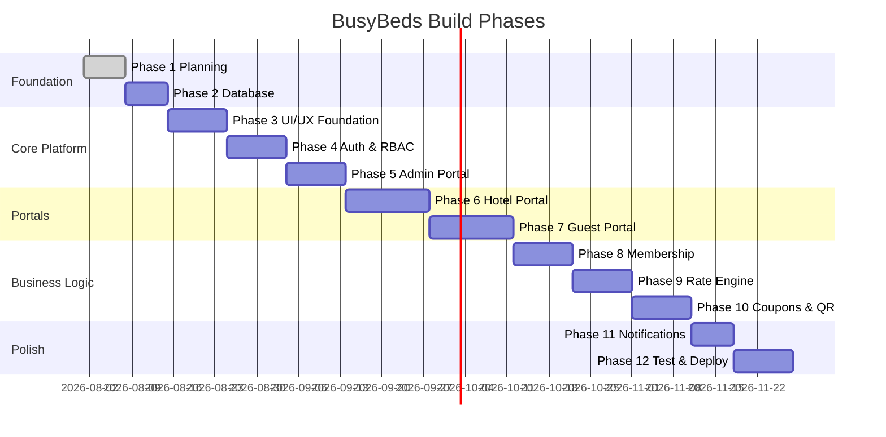

# BusyBeds — Implementation Roadmap

**Version:** 1.0  
**Approach:** Phased delivery — each phase produces deployable, testable increments.

---

## Phase Overview

*Timeline bars are sequencing guides, not calendar commitments.*

---

## Phase 1: Requirements & Planning ✅ (Current)

**Deliverables:**
- [x] PRD (`docs/PRD.md`)
- [x] User stories (`docs/USER_STORIES.md`)
- [x] Architecture (`docs/ARCHITECTURE.md`)
- [x] Database design (`docs/DATABASE_DESIGN.md`)
- [x] Roadmap (`docs/ROADMAP.md`)
- [x] UI/UX guidelines (`docs/UI_UX.md`)

**Exit criteria:** Stakeholder review of open questions in PRD §16.

---

## Phase 2: Database & Project Scaffold

**Goals:** Runnable monorepo skeleton with database.

**Tasks:**
1. Initialize Next.js 15 + TypeScript + Tailwind + shadcn/ui
2. Prisma setup + PostgreSQL connection
3. Implement schema from `DATABASE_DESIGN.md` (migrations)
4. Auth.js adapter tables
5. Seed script: plans, permissions, demo hotel
6. Docker Compose for local Postgres
7. ESLint, Prettier, strict TS config
8. GitHub Actions: lint + typecheck

**Exit criteria:** `pnpm dev` runs; migrations apply; seed data queryable.

---

## Phase 3: UI/UX Foundation

**Goals:** Design system and layout shells for all portals.

**Tasks:**
1. Brand tokens (colors, typography — Africa-premium aesthetic)
2. Layout components: marketing, auth, dashboard sidebars
3. Core components: HotelCard, RateDisplay, CouponCard, DataTable
4. Framer Motion page transitions (subtle)
5. Responsive breakpoints; mobile-first navigation
6. Empty states, loading skeletons, error boundaries

**Exit criteria:** Static portal shells navigable with mock data.

---

## Phase 4: Authentication & RBAC

**Goals:** Secure login for all roles.

**Tasks:**
1. Auth.js: credentials provider, email verification flow
2. JWT session with org contexts in token
3. `lib/auth/permissions.ts` + `authorize()` helper
4. Middleware: route protection per portal prefix
5. Registration flows: guest, hotel owner (separate onboarding)
6. Password reset
7. Rate limiting on auth endpoints
8. Audit log on login failures and role changes

**Exit criteria:** Each role can only access permitted routes; integration tests pass.

---

## Phase 5: Admin Portal

**Goals:** Platform operators can manage the network.

**Tasks:**
1. Admin dashboard layout
2. Hotel approval queue (approve/reject)
3. Rate approval queue
4. User search and subscription view
5. Membership plan CRUD
6. Basic platform metrics (member count, hotel count)
7. Audit log viewer

**Exit criteria:** Admin can approve a seeded hotel and rates end-to-end.

---

## Phase 6: Hotel Portal

**Goals:** Hotels manage their presence and staff.

**Tasks:**
1. Hotel profile editor (text, amenities, policies)
2. Photo upload to R2 (presigned URLs)
3. Room type CRUD
4. Rate creation UI (rack + STO, seasons, dates)
5. Rate submit for approval workflow
6. Staff invitation and role management
7. Hotel analytics v1 (redemption counts)
8. Reception-only verify UI stub (full in Phase 10)

**Exit criteria:** Hotel owner completes onboarding flow; rates enter admin queue.

---

## Phase 7: Guest Portal

**Goals:** Members discover hotels and see savings.

**Tasks:**
1. Marketing landing pages
2. Membership plan comparison page
3. Hotel search with filters
4. Hotel detail page with date picker
5. Rate display component (rack, member, savings)
6. Member dashboard shell (membership status)
7. Membership gate middleware

**Exit criteria:** Search returns approved hotels; savings display with mock/seed rates.

---

## Phase 8: Membership System

**Goals:** Paid subscriptions activate member access.

**Tasks:**
1. Payment provider interface
2. Stripe adapter (international cards)
3. Flutterwave adapter (Africa)
4. PesaPal adapter (East Africa mobile money)
5. Checkout flow + success/cancel pages
6. Webhook handlers (idempotent)
7. Subscription lifecycle service
8. Renewal reminders (email stub)

**Exit criteria:** Test mode subscription activates membership; gate unlocks member prices.

---

## Phase 9: STO/Rack Rate Engine

**Goals:** Production rate resolution for any date.

**Tasks:**
1. `RateEngine` service: context priority resolution
2. Pair rack + STO for display
3. Discount calculation utility (shared client/server)
4. Rate history on approval/archive
5. Validation: overlaps, STO ≤ rack warnings
6. API: `GET /api/rates/resolve?roomTypeId&date`
7. Unit tests: season, weekend, holiday edge cases

**Exit criteria:** All test scenarios in rate engine spec pass; UI shows correct prices.

---

## Phase 10: Coupon & QR System

**Goals:** End-to-end member → hotel redemption.

**Tasks:**
1. Coupon generation service (signed tokens)
2. QR code rendering (member wallet)
3. Coupon wallet UI (active/used/expired)
4. Reception: scan + manual code entry
5. Verification API with membership check
6. Redemption flow + loyalty points trigger
7. Coupon expiry job (cron)

**Exit criteria:** Full Flow 4 from PRD works in staging with test hotel.

---

## Phase 11: Notifications

**Goals:** Multi-channel transactional messaging.

**Tasks:**
1. Notification service + event registry
2. Email provider (Resend / SendGrid)
3. SMS provider (Africa's Talking / Twilio)
4. WhatsApp provider stub (Meta Cloud API)
5. Push notification stub (web push)
6. Templates for key events
7. NotificationLog + retry queue

**Exit criteria:** Coupon created → email + optional SMS delivered in staging.

---

## Phase 12: Testing, Hardening & Deployment

**Goals:** Production-ready release.

**Tasks:**
1. E2E tests (Playwright): register → subscribe → coupon → redeem
2. Security review: OWASP checklist
3. Load test: search and coupon verify paths
4. Corporate portal (seats, invites) — P1
5. Loyalty/referrals — P1
6. Production env config, secrets management
7. Deploy to Vercel + managed Postgres
8. Runbook + monitoring alerts
9. Documentation: API, onboarding guides for hotels

**Exit criteria:** E2E green; staging sign-off; production deploy with smoke tests.

---

## Post-v1 Backlog

| Item | Priority |
|------|----------|
| Swahili localization | P2 |
| Algolia / full-text search | P2 |
| Redis rate cache | P2 |
| Mobile apps | P2 |
| PMS integrations | P3 |
| Member reviews | P2 |
| Dynamic corporate invoicing | P2 |
| Hotel contract management | P3 |

---

## Definition of Done (Global)

- [ ] TypeScript strict, no `any` without justification
- [ ] Unit tests for business logic (rate engine, coupons, permissions)
- [ ] Authorization checked in service layer
- [ ] Audit log for sensitive mutations
- [ ] Mobile-responsive UI
- [ ] API input validation (Zod)
- [ ] Migrations committed with schema changes
- [ ] PR reviewed; CI green

---

## Environment & Secrets Checklist

| Secret | Phase |
|--------|-------|
| `DATABASE_URL` | 2 |
| `AUTH_SECRET` | 4 |
| `R2_ACCESS_KEY`, `R2_BUCKET` | 6 |
| `STRIPE_*` | 8 |
| `FLUTTERWAVE_*`, `PESAPAL_*` | 8 |
| `RESEND_API_KEY` / SMS keys | 11 |
| `SENTRY_DSN` | 12 |

---

## Recommended First Sprint (After Planning)

**Sprint 1:** Phase 2 + Phase 3 (scaffold + design system)  
**Sprint 2:** Phase 4 (auth/RBAC)  
**Sprint 3:** Phase 5 + Phase 6 start (admin + hotel profile)

This establishes the platform skeleton before guest-facing commerce flows.
